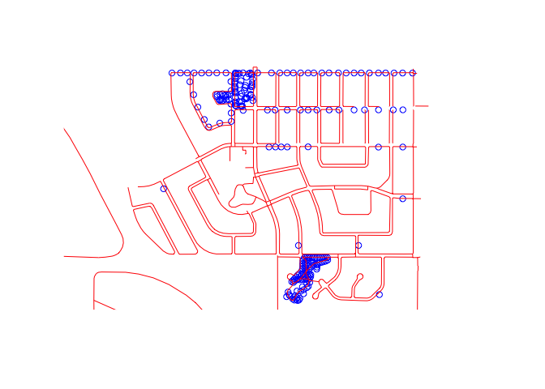
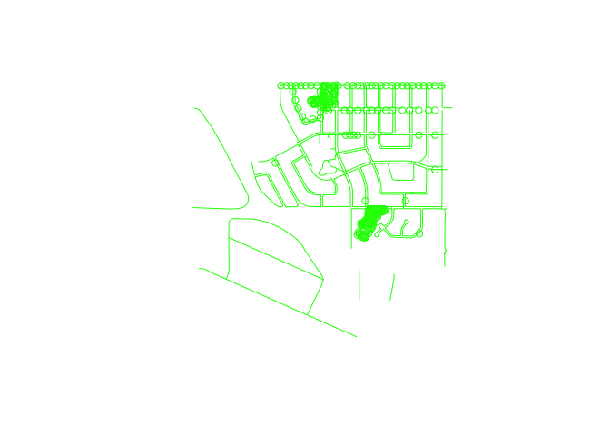

## Avalon (well-mapped in osm neighbourhood) PLOS


##### Reading csv files, merging all line-level data in one table based on the common for sidewalk and highway tables columns.

```r
sidewalks <- read.csv("/Users/olechka/Documents/R/challenges/PLOS_AVALON/sidewalks.csv")
highways <- read_csv("/Users/olechka/Documents/R/challenges/PLOS_AVALON/highway.csv")
```

```
## Rows: 11 Columns: 30
## ── Column specification ────────────────────────────────────────────────────────
## Delimiter: ","
## chr (27): wkt_geom, full_id, osm_type, highway, service, railway, constructi...
## dbl  (3): fid, osm_id, maxspeed
## 
## ℹ Use `spec()` to retrieve the full column specification for this data.
## ℹ Specify the column types or set `show_col_types = FALSE` to quiet this message.
```

```r
line_data <- merge(sidewalks, highways, by = c("wkt_geom", "fid", "full_id", "osm_id", "osm_type", "highway", "motor_vehicle", "access", "horse", "foot", "lit", "oneway", "surface", "bicycle", "name"), all = TRUE)
```

##### Now moving to point data and repeatins previous actions - merging all point-level data in one table based on the common for trees, lights, and parking tables columns.

```r
trees <- read.csv("/Users/olechka/Documents/R/challenges/PLOS_AVALON/trees.csv")
lights <- read.csv("/Users/olechka/Documents/R/challenges/PLOS_AVALON/street_lamp.csv")
parking <- read.csv("/Users/olechka/Documents/R/challenges/PLOS_AVALON/parking_aisle.csv")
point_data <- merge( trees, lights, by = c("wkt_geom", "fid", "full_id", "osm_id", "osm_type", "lit"), all = TRUE)

point_data_full <- merge( point_data, parking, by = c("wkt_geom", "fid", "full_id", "osm_id", "osm_type"), all = TRUE)
```


##### Performing join of points and lines to create a master df file

```r
Avalon_PLOS_df <- full_join(point_data_full, line_data)
```

```
## Joining with `by = join_by(wkt_geom, fid, full_id, osm_id, osm_type, lit,
## crossing.markings, kerb, crossing, name, railway, access)`
```

```r
head(Avalon_PLOS_df)
```

```
##                                              wkt_geom fid     full_id
## 1 Point (-106.64668960000000197 52.10014530000000121) 722 n4310616176
## 2 Point (-106.64730729999999426 52.09870020000000324) 746 n4310616521
## 3 Point (-106.64731439999999907 52.09723859999999718) 753 n4310817166
## 4 Point (-106.64731449999999313 52.09520580000000223) 755 n4310817181
## 5 Point (-106.64732429999999397 52.10014569999999878) 721 n4310616175
## 6 Point (-106.64787420000000395 52.10014590000000112) 720 n4310616174
##       osm_id osm_type  lit natural circumference species height leaf_cycle
## 1 4310616176     node <NA>    <NA>          <NA>    <NA>   <NA>       <NA>
## 2 4310616521     node <NA>    <NA>          <NA>    <NA>   <NA>       <NA>
## 3 4310817166     node <NA>    <NA>          <NA>    <NA>   <NA>       <NA>
## 4 4310817181     node <NA>    <NA>          <NA>    <NA>   <NA>       <NA>
## 5 4310616175     node <NA>    <NA>          <NA>    <NA>   <NA>       <NA>
## 6 4310616174     node <NA>    <NA>          <NA>    <NA>   <NA>       <NA>
##   leaf_type denotation   highway.x lamp_mount material.x power lamp_type
## 1      <NA>       <NA> street_lamp       NULL       NULL  pole  electric
## 2      <NA>       <NA> street_lamp       NULL       NULL  pole  electric
## 3      <NA>       <NA> street_lamp       NULL       NULL  pole  electric
## 4      <NA>       <NA> street_lamp       NULL       NULL  pole  electric
## 5      <NA>       <NA> street_lamp       NULL       NULL  pole  electric
## 6      <NA>       <NA> street_lamp       NULL       NULL  pole  electric
##   highway.y stop direction material.y traffic_calming traffic_signals.direction
## 1      <NA> <NA>      <NA>       <NA>            <NA>                      <NA>
## 2      <NA> <NA>      <NA>       <NA>            <NA>                      <NA>
## 3      <NA> <NA>      <NA>       <NA>            <NA>                      <NA>
## 4      <NA> <NA>      <NA>       <NA>            <NA>                      <NA>
## 5      <NA> <NA>      <NA>       <NA>            <NA>                      <NA>
## 6      <NA> <NA>      <NA>       <NA>            <NA>                      <NA>
##   noexit crossing.markings gate.type name.en addr.street addr.postcode
## 1   <NA>              <NA>      <NA>    <NA>        <NA>          <NA>
## 2   <NA>              <NA>      <NA>    <NA>        <NA>          <NA>
## 3   <NA>              <NA>      <NA>    <NA>        <NA>          <NA>
## 4   <NA>              <NA>      <NA>    <NA>        <NA>          <NA>
## 5   <NA>              <NA>      <NA>    <NA>        <NA>          <NA>
## 6   <NA>              <NA>      <NA>    <NA>        <NA>          <NA>
##   addr.housenumber sloped_curb kerb lift_gate.type crossing button_operated
## 1             <NA>        <NA> <NA>           <NA>     <NA>            <NA>
## 2             <NA>        <NA> <NA>           <NA>     <NA>            <NA>
## 3             <NA>        <NA> <NA>           <NA>     <NA>            <NA>
## 4             <NA>        <NA> <NA>           <NA>     <NA>            <NA>
## 5             <NA>        <NA> <NA>           <NA>     <NA>            <NA>
## 6             <NA>        <NA> <NA>           <NA>     <NA>            <NA>
##   amenity entrance  bus public_transport name railway access barrier
## 1    <NA>     <NA> <NA>             <NA> <NA>    <NA>   <NA>    <NA>
## 2    <NA>     <NA> <NA>             <NA> <NA>    <NA>   <NA>    <NA>
## 3    <NA>     <NA> <NA>             <NA> <NA>    <NA>   <NA>    <NA>
## 4    <NA>     <NA> <NA>             <NA> <NA>    <NA>   <NA>    <NA>
## 5    <NA>     <NA> <NA>             <NA> <NA>    <NA>   <NA>    <NA>
## 6    <NA>     <NA> <NA>             <NA> <NA>    <NA>   <NA>    <NA>
##   traffic_signals highway motor_vehicle horse foot oneway surface bicycle
## 1            <NA>    <NA>          <NA>  <NA> <NA>   <NA>    <NA>    <NA>
## 2            <NA>    <NA>          <NA>  <NA> <NA>   <NA>    <NA>    <NA>
## 3            <NA>    <NA>          <NA>  <NA> <NA>   <NA>    <NA>    <NA>
## 4            <NA>    <NA>          <NA>  <NA> <NA>   <NA>    <NA>    <NA>
## 5            <NA>    <NA>          <NA>  <NA> <NA>   <NA>    <NA>    <NA>
## 6            <NA>    <NA>          <NA>  <NA> <NA>   <NA>    <NA>    <NA>
##   covered embankment bridge.name trail_visibility mtb.scale.uphill mtb.scale
## 1    <NA>       <NA>        <NA>             <NA>             <NA>      <NA>
## 2    <NA>       <NA>        <NA>             <NA>             <NA>      <NA>
## 3    <NA>       <NA>        <NA>             <NA>             <NA>      <NA>
## 4    <NA>       <NA>        <NA>             <NA>             <NA>      <NA>
## 5    <NA>       <NA>        <NA>             <NA>             <NA>      <NA>
## 6    <NA>       <NA>        <NA>             <NA>             <NA>      <NA>
##   incline golf width segregated footway tunnel layer bridge service
## 1    <NA> <NA>  <NA>       <NA>    <NA>   <NA>  <NA>   <NA>    <NA>
## 2    <NA> <NA>  <NA>       <NA>    <NA>   <NA>  <NA>   <NA>    <NA>
## 3    <NA> <NA>  <NA>       <NA>    <NA>   <NA>  <NA>   <NA>    <NA>
## 4    <NA> <NA>  <NA>       <NA>    <NA>   <NA>  <NA>   <NA>    <NA>
## 5    <NA> <NA>  <NA>       <NA>    <NA>   <NA>  <NA>   <NA>    <NA>
## 6    <NA> <NA>  <NA>       <NA>    <NA>   <NA>  <NA>   <NA>    <NA>
##   construction lanes:forward lanes:backward  hgv junction alt_name
## 1         <NA>          <NA>           <NA> <NA>     <NA>     <NA>
## 2         <NA>          <NA>           <NA> <NA>     <NA>     <NA>
## 3         <NA>          <NA>           <NA> <NA>     <NA>     <NA>
## 4         <NA>          <NA>           <NA> <NA>     <NA>     <NA>
## 5         <NA>          <NA>           <NA> <NA>     <NA>     <NA>
## 6         <NA>          <NA>           <NA> <NA>     <NA>     <NA>
##   lane_markings vehicle sidewalk  psv lanes maxspeed loc_name
## 1          <NA>    <NA>     <NA> <NA>  <NA>       NA     <NA>
## 2          <NA>    <NA>     <NA> <NA>  <NA>       NA     <NA>
## 3          <NA>    <NA>     <NA> <NA>  <NA>       NA     <NA>
## 4          <NA>    <NA>     <NA> <NA>  <NA>       NA     <NA>
## 5          <NA>    <NA>     <NA> <NA>  <NA>       NA     <NA>
## 6          <NA>    <NA>     <NA> <NA>  <NA>       NA     <NA>
```


##### converting df into sf because we weren't able to write shp

```r
Avalon_PLOS_sf <- st_as_sf(Avalon_PLOS_df, wkt = "wkt_geom", crs = 4326)
Avalon_PLOS_sf <- Avalon_PLOS_sf %>%   mutate_if(is.character, ~ if_else(. == "NULL", NA_character_, .))
point_data_sf <- st_as_sf(point_data_full, wkt = "wkt_geom", crs = 4326)
line_data_sf <- st_as_sf(line_data, wkt = "wkt_geom", crs = 4326)

plot(st_geometry(point_data_sf), col = 'blue')
plot(st_geometry(line_data_sf), col = 'red', add = TRUE)   
```

<!-- -->

```r
plot(st_geometry(Avalon_PLOS_sf), col = "green")
```

<!-- -->

