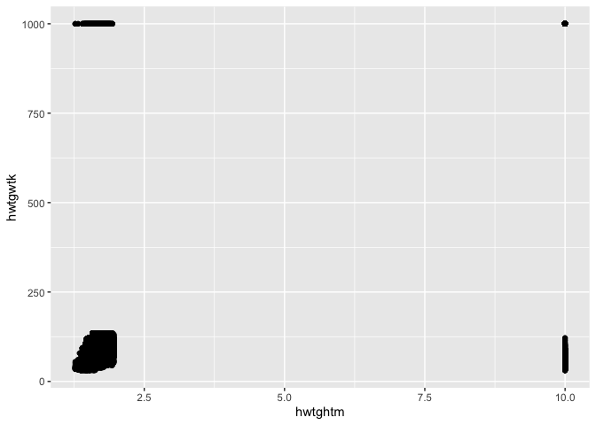
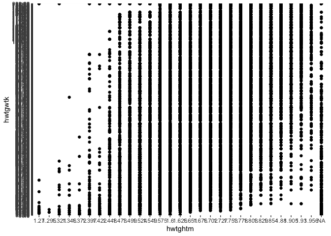
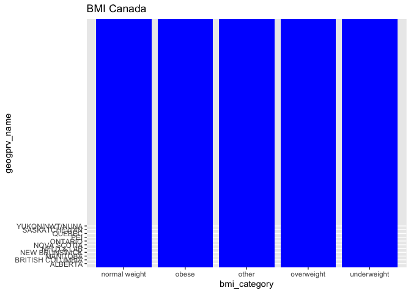
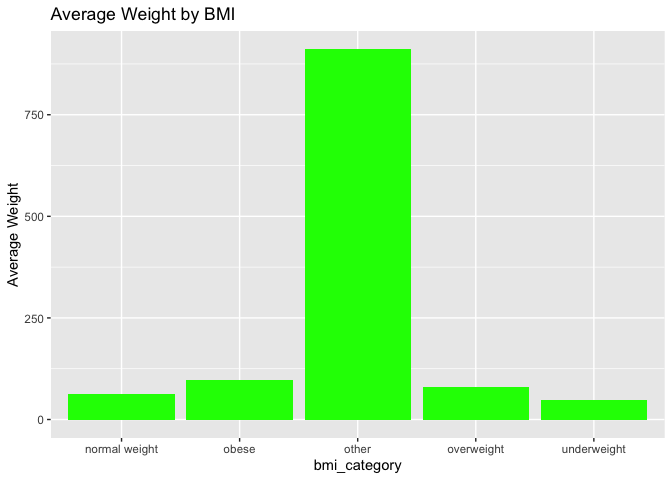
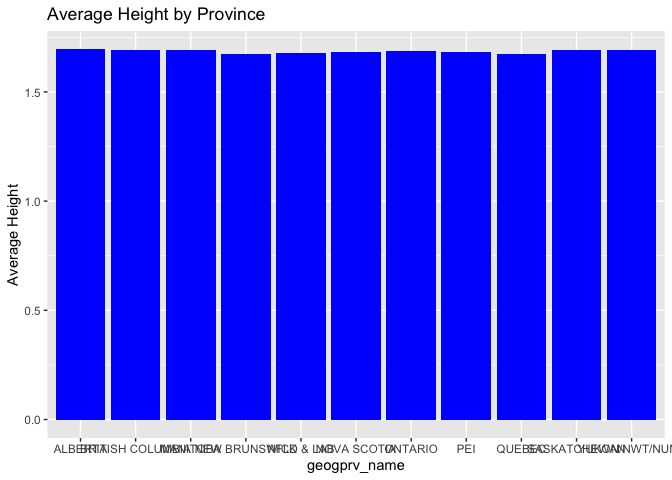

## Me trying to beat the R 

Needed packages installation:


##### Reading CCHS 2012 csv file, checking if R reads all the variables in the table as numbers

```r
cchs <- read_csv("/Users/olechka/Documents/R/challenges/CCHS_2012.csv")
```

```
## Rows: 124929 Columns: 36
## ── Column specification ────────────────────────────────────────────────────────
## Delimiter: ","
## dbl (36): CASEID, verdate, adm_prx, adm_n09, adm_n10, adm_n11, adm_rno, pmkp...
## 
## ℹ Use `spec()` to retrieve the full column specification for this data.
## ℹ Specify the column types or set `show_col_types = FALSE` to quiet this message.
```

```r
head(cchs, 10)
```

```
## # A tibble: 10 × 36
##    CASEID  verdate adm_prx adm_n09 adm_n10 adm_n11 adm_rno pmkproxy geogprv
##     <dbl>    <dbl>   <dbl>   <dbl>   <dbl>   <dbl>   <dbl>    <dbl>   <dbl>
##  1      1 20130913       2       1       1       6       1        6      35
##  2      2 20130913       2       6       1       6       2        6      59
##  3      3 20130913       2       6       1       6       3        6      35
##  4      4 20130913       2       6       1       6       4        6      46
##  5      5 20130913       2       6       1       6       5        6      24
##  6      6 20130913       2       2       1       6       6        6      48
##  7      7 20130913       2       2       1       6       7        6      12
##  8      8 20130913       1       1       1       6       8        6      48
##  9      9 20130913       2       6       1       6       9        6      35
## 10     10 20130913       2       2       1       6      10        6      59
## # ℹ 27 more variables: geodpmf <dbl>, geodbcha <dbl>, sdcgcb12 <dbl>,
## #   sdc_5a_1 <dbl>, sdcdfols <dbl>, dhh_own <dbl>, sdcglhm <dbl>,
## #   sdcfimm <dbl>, sdcgres <dbl>, sdcgcgt <dbl>, sdc_8 <dbl>, sdcg9 <dbl>,
## #   dhhgage <dbl>, dhh_sex <dbl>, dhhgms <dbl>, dhhgle5 <dbl>, dhhg611 <dbl>,
## #   dhhgl12 <dbl>, dhhglvg <dbl>, dhhghsz <dbl>, hwt_4 <dbl>, hwtghtm <dbl>,
## #   hwtgwtk <dbl>, hwtgbmi <dbl>, hwtgisw <dbl>, hwtdcol <dbl>, wts_m <dbl>
```

```r
sapply(cchs, class)
```

```
##    CASEID   verdate   adm_prx   adm_n09   adm_n10   adm_n11   adm_rno  pmkproxy 
## "numeric" "numeric" "numeric" "numeric" "numeric" "numeric" "numeric" "numeric" 
##   geogprv   geodpmf  geodbcha  sdcgcb12  sdc_5a_1  sdcdfols   dhh_own   sdcglhm 
## "numeric" "numeric" "numeric" "numeric" "numeric" "numeric" "numeric" "numeric" 
##   sdcfimm   sdcgres   sdcgcgt     sdc_8     sdcg9   dhhgage   dhh_sex    dhhgms 
## "numeric" "numeric" "numeric" "numeric" "numeric" "numeric" "numeric" "numeric" 
##   dhhgle5   dhhg611   dhhgl12   dhhglvg   dhhghsz     hwt_4   hwtghtm   hwtgwtk 
## "numeric" "numeric" "numeric" "numeric" "numeric" "numeric" "numeric" "numeric" 
##   hwtgbmi   hwtgisw   hwtdcol     wts_m 
## "numeric" "numeric" "numeric" "numeric"
```

##### We checked, now creating a basic plot


```r
ggplot(cchs, aes(x = hwtghtm, y = hwtgwtk)) + geom_point()
```

<!-- -->
*What an ugly plot to be honest...*

##### Making missing data become NA instead of numbers:

```r
cchs_clean <- cchs %>% mutate(hwtghtm = factor(hwtghtm))
cchs_clean <- cchs_clean %>% mutate(hwtgwtk = factor(hwtgwtk))
cchs_clean <- cchs_clean %>% mutate(hwtghtm = fct_recode(hwtghtm, NULL = "9.996", NULL = "9.999"))
```

##### Now creating Body Mass Index categories:

```r
ggplot(cchs_clean, aes(x = hwtghtm, y = hwtgwtk)) + geom_point()
```

<!-- -->

```r
cchs_clean <- cchs_clean %>%
  mutate(bmi_category = case_when(
    hwtgbmi < 18.5 ~ "underweight",
    hwtgbmi >=30 & hwtgbmi <999 ~ "obese",
    hwtgbmi >=25 & hwtgbmi <30 ~ "overweight",
    hwtgbmi >=18.5 & hwtgbmi <25 ~ "normal weight",
    TRUE ~ "other"
  ))
```

##### Identifying provinces' names:


```r
cchs_clean <- cchs_clean %>%
  mutate(geogprv_name = case_when(
    geogprv == 10 ~ "NFLD & LAB",
    geogprv == 11 ~ "PEI",
    geogprv == 12 ~ "NOVA SCOTIA",
    geogprv == 13 ~ "NEW BRUNSWICK",
    geogprv == 24 ~ "QUEBEC",
    geogprv == 35 ~ "ONTARIO",
    geogprv == 46 ~ "MANITOBA",
    geogprv == 47 ~ "SASKATCHEWAN",
    geogprv == 48 ~ "ALBERTA",
    geogprv == 59 ~ "BRITISH COLUMBIA",
    geogprv == 60 ~ "YUKON/NWT/NUNA",
    geogprv == 96 ~ "NOT APPLICABLE",
    geogprv == 97 ~ "DON'T KNOW",
    geogprv == 98 ~ "REFUSAL",
    TRUE ~ "NOT STATED"
  ))
```

##### Since we turned the numeric variables hwtghtm and hwtgwtk into the factor, R cannot complete the summarize process, so let's assume mutating them back into numeric won't crush everythimg we did before:


```r
cchs_clean$hwtgwtk <- as.numeric(as.character(cchs_clean$hwtgwtk))
cchs_clean$hwtghtm <- as.numeric(as.character(cchs_clean$hwtghtm))

summarize(
  group_by(cchs_clean, bmi_category), 
  avg_ht = mean(hwtghtm, na.rm = T), 
  sd_ht = sd(hwtghtm, na.rm = T),
  avg_wt = mean(hwtgwtk, na.rm = T), 
  sd_wt = sd(hwtgwtk, na.rm = T)
)
```

```
## # A tibble: 5 × 5
##   bmi_category  avg_ht  sd_ht avg_wt  sd_wt
##   <chr>          <dbl>  <dbl>  <dbl>  <dbl>
## 1 normal weight   1.68 0.0973   63.5   9.43
## 2 obese           1.68 0.105    97.0  14.6 
## 3 other           1.65 0.0889  911.  275.  
## 4 overweight      1.70 0.101    79.0  10.3 
## 5 underweight     1.66 0.102    47.6   6.45
```

##### This data is not for analysis, but let's give it a try...

```r
ggplot(group_by(cchs_clean, bmi_category), aes(x = bmi_category, y = geogprv_name)) +
  geom_bar(stat = "summary", fun = "mean", fill = "blue") +
  ggtitle("BMI Canada")
```

<!-- -->

```r
ggplot(group_by(cchs_clean, bmi_category), aes(x = bmi_category, y = hwtgwtk)) +
  geom_bar(stat = "summary", fun = "mean", fill = "green") +
  ylab("Average Weight") +
  ggtitle("Average Weight by BMI")
```

<!-- -->

```r
ggplot(group_by(cchs_clean, geogprv_name), aes(x = geogprv_name, y = hwtghtm)) +
  geom_bar(stat = "summary", fun = "mean", fill = "blue") +
  ylab("Average Height") +
  ggtitle("Average Height by Province")
```

```
## Warning: Removed 4923 rows containing non-finite outside the scale range
## (`stat_summary()`).
```

<!-- -->
